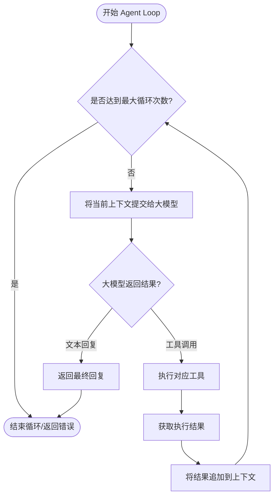
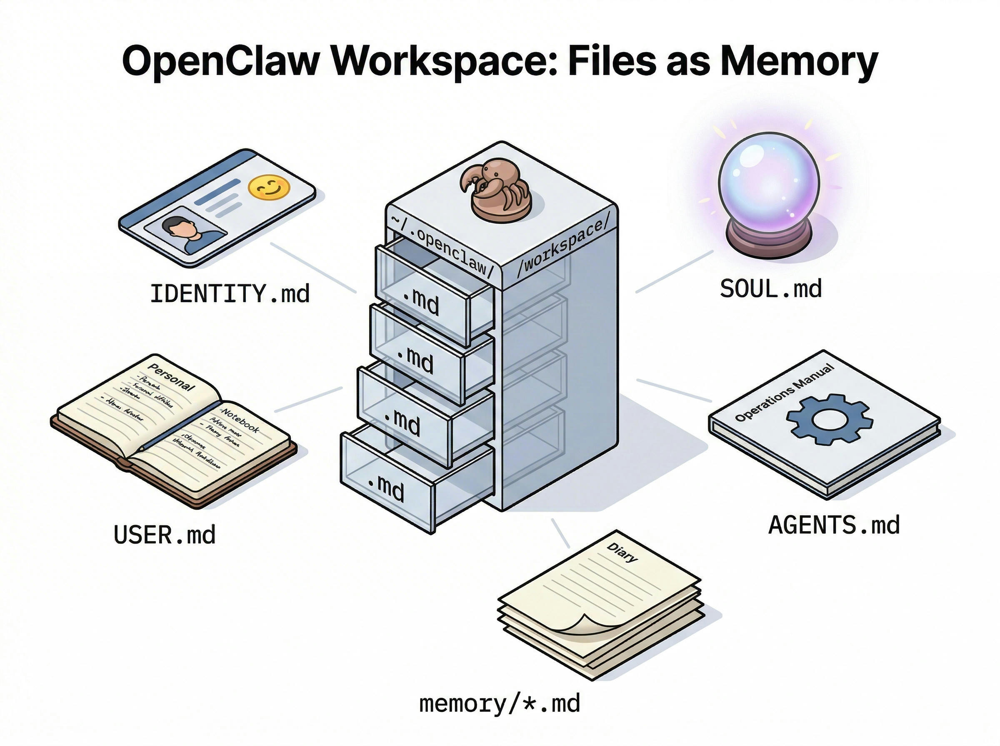
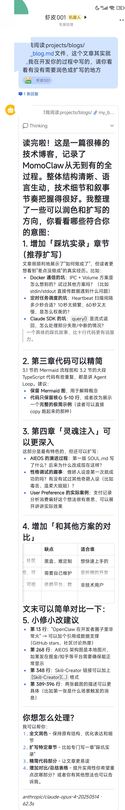

# 亲手造一只有灵魂的 AI 小龙虾是种什么体验？


> "凌晨 3 点，我的手机突然亮了。打开一看，是我昨天'造'的小龙虾发来的消息：'主人，你明天的会议材料我准备好了，还有——别忘带伞，要下雨。'"

那一刻，我突然意识到：我造的不只是一个工具，而是一个**会关心人的数字生命**。

---

## 一、前言：为什么要"造轮子"？

最近，OpenClaw 在开发者圈子里非常火。截至 2026 年初，它在 GitHub 上已经斩获 33k+ stars，成为 AI Agent 领域的现象级开源项目。这个工具以其强大的自动化能力和开放的架构，吸引了大量开发者关注。

但我没有选择直接用它。**我想自己造一个**。

不是因为我比 OpenClaw 的作者更牛，而是因为——

> **"理解它的最好方式，就是亲手实现一个。"**

在 AI 辅助编程的时代，"造轮子"的成本已经大大降低。与其在黑盒里摸索，不如亲手打造自己的工具。所有代码都在本地运行，每一行都是自己亲眼看着 AI 写出来的。

没有黑盒，没有"这个功能怎么实现的"的困惑，一切都在自己的掌握之中。

这，就是学习新技术的最优解。

---

## 二、OpenClaw 核心设计解析

在动手之前，我们先拆解一下 OpenClaw 的核心架构。看看这位"前辈"是怎么设计的。

### 2.1 Agentic Loop：AI 的"思考-行动"循环

OpenClaw 的核心引擎本质上是一个**消息驱动的 agentic loop 运行时**。

传统 AI 是"一问一答"就结束了。但 OpenClaw 不一样——它会**持续思考、执行、观察结果**，直到任务完成。

```
┌─────────┐     ┌─────────┐     ┌─────────┐     ┌─────────┐     ┌─────────┐
│ 用户输入 │ ──→ │ 理解意图 │ ──→ │ 规划步骤 │ ──→ │ 执行工具 │ ──→ │ 观察结果 │
└─────────┘     └─────────┘     └─────────┘     └─────────┘     └────┬────┘
                                                                     │
                    ┌────────────────────────────────────────────────┘
                    │
                    ▼
            ┌───────────────┐
            │   任务完成？   │
            └───────┬───────┘
                    │
        ┌───────────┴───────────┐
        │                       │
       是                       否
        │                       │
        ▼                       ▼
┌───────────────┐      ┌───────────────┐
│  返回最终结果  │      │  重新规划步骤  │
└───────────────┘      └───────┬───────┘
                               │
                               └────────────────→ (回到"规划步骤")
```

AI 收到任务后，会反复"思考→执行→检查"，直到把事情做完。

### 2.2 24小时在线的秘密：Cron + Heartbeat

OpenClaw 最让我惊艳的功能是**主动通信**。

不同于传统被动等待指令的 AI，它能像真人助理一样**主动发起对话**。这背后是两大核心组件：

#### **Cron：时间感知器**

赋予小龙虾"时间感"，让它按计划执行任务，这里我把定时任务分为三种模式，更加灵活：

| 模式 | 用途 | 示例 |
|------|------|------|
| **Cron 表达式** | 周期性任务 | `0 9 * * *` 每天9点早报 |
| **Interval** | 轮询监控 | 每1小时检查邮件 |
| **Once** | 一次性提醒 | 明天下午3点提醒开会 |

所有任务持久化到 SQLite，即使重启也不会丢失。

#### **Heartbeat：永不停歇的脉搏**

```
每 10 秒 → 扫描数据库 → 发现到期任务 → 唤醒 Agent → 执行 → 推送结果
```

最妙的是：**Heartbeat 任务由 AI 自己决定**。

在日常对话中，AI 会判断哪些事项需要未来提醒，自动写入数据库。你不需要手动设置任何定时任务。

这就是从"工具"到"智能助手"的质变。

### 2.3 核心设计理念（干货速览）

在 OpenClaw 的设计理念中，我得到了三个关键启发：

| 设计原则 | OpenClaw 做法 | 传统做法 | 为什么更好 |
|---------|--------------|---------|-----------|
| **文件存储** | Markdown + SQLite | 向量数据库 | 透明可控，随时可查 |
| **Skills 系统** | 文件系统组织 | 硬编码 | 渐进式加载，自主学习 |
| **主动通信** | Heartbeat + Cron | 被动等待 | 7x24在线，主动关怀 |

**一切的一切，能由 AI 自己去做抉择的，不要人工干涉！**

---

## 三、给自己专属"小龙虾"塑形

好了，理论聊完，开始动手。

要实现自己专属的小龙虾，核心要解决三个问题：

1. **Agent Loop 的实现** —— 让 AI 能思考、能行动
2. **会话和记忆系统** —— 让 AI 记得住、学得会
3. **定时任务调度** —— 让 AI 能主动、能提醒

### 3.1 Agent Loop 实现

Agent Loop 的本质很简单：**一个无限循环**。



每次循环把上下文传给大模型：
- 如果返回工具调用 → 执行工具 → 结果返回给模型
- 如果返回文本 → 任务完成

**但这一切不需要我们自己实现。**

Claude Code 被誉为最牛叉的 Agent 智能体，我们直接用其 SDK 套壳即可：

```ts
import { query } from '@anthropic-ai/claude-agent-sdk';

for await (const message of query({
    prompt: fullPrompt,
    options: {
      cwd: WORKSPACE_DIR,
      systemPrompt: enhancedSystemPrompt
        ? {
            type: 'preset',
            preset: 'claude_code',
            append: enhancedSystemPrompt,
          }
        : { type: 'preset', preset: 'claude_code' },
      allowedTools: ['Read', 'Write', 'Edit', 'Glob'],
      model: apiConfig.model,
      mcpServers: { my_mcp: myMcpServer },
    },
  })) {
    // 处理流式输出...
  }
```

### 3.2 隔离环境：别让小龙虾"拆家"

说实话，第一次跑 Docker 的时候我很慌。

生怕它把我机器搞崩，或者偷偷删我文件。毕竟，Agent 可是有文件读写权限的！

**解决方案：每个 Agent 运行在独立的 Docker 容器中。**

并且，通过 Docker 的方式去运行 Agent，我们还能很方便地去搭建 Agent Team，确保了每个 Agent 都在一个独立的环境中运行，互不干扰。

问题是——怎么把参数、变量传进去？我采用 **IPC 通信 + Volume 挂载**：

```ts
// Host.ts - 核心逻辑
export async function runContainerAgent(payload: PromptPayload) {
  // 1. 创建临时目录用于 IPC
  const tempDir = join(tmpdir(), `miniclaw-${sessionId}`);
  const inputDir = join(tempDir, 'input');
  const outputDir = join(tempDir, 'output');

  // 2. 写入 prompt 到输入文件
  writeFileSync(
    join(inputDir, 'payload.json'),
    JSON.stringify(payload, null, 2)
  );

  // 3. 构建 Docker 参数（核心挂载点）
  const dockerArgs = [
    'run', '--rm', '-i', '--network=host',
    '--memory=2g', '--cpus=2',           // 资源限制
    `-v ${workspacePath}:/workspace/files:rw`,
    `-v ${inputDir}:/workspace/input:ro`,
    `-v ${outputDir}:/workspace/output:rw`,
    '-e INPUT_FILE=/workspace/input/payload.json',
    '-e OUTPUT_FILE=/workspace/output/result.json',
    CONTAINER_IMAGE,
    'node', '/app/dist/index.js',
  ];

  // 4. 启动容器，流式处理输出
  const child = spawn('docker', dockerArgs);
  // ... 处理 stdout/stderr
}
```

| 参数 | 作用 | 建议值 |
|------|------|--------|
| `--memory=2g` | 内存限制 | 2GB 足够 |
| `--cpus=2` | CPU 限制 | 2核 |
| `--network=host` | 网络模式 | 方便调试 |

这样，即使 Agent "发疯"，也只是在一个隔离的沙箱里折腾，不会影响宿主机器。

### 3.3 定时任务调度系统

想要你的小龙虾足够聪明活泼，能够主动找你，就需要一个**定时任务调度系统**。

实现原理：

```
用户自然语言输入
    ↓
Agent 解析 → 生成 cron 表达式
    ↓
通过 MCP/Tool 写入 SQLite
    ↓
调度系统定时检查
    ↓
到期任务 → 唤醒 Agent → 执行
```

关键是：**整个过程都是 Agent 自主完成的**，用户只需要说"明天早上9点叫我起床"就行。

### 3.4 阶段小结

到这里，我们已经完成了：

- ✅ Agent Loop：能思考、能行动
- ✅ 隔离环境：安全可控
- ✅ 定时调度：能主动、能提醒

但还缺少一个关键要素——**灵魂**。

---

## 四、给你的小龙虾注入灵魂

### 4.1 AIEOS 协议：AI 的"灵魂芯片"

如果把 LLM 比作一个拥有超强智商但没有记忆和性格的"大脑"，那么 **AIEOS 协议** 就是给这个大脑植入的**"灵魂芯片"**。

它是开源社区兴起的开放标准（Portable AI Personas），让你的 AI：

- **有性格**：不再是冷冰冰的复读机，而是有名字、有价值观、甚至有小脾气的"数字伙伴"
- **可移植**：无论底层换 Claude、GPT 还是 DeepSeek，只要加载 AIEOS 配置，它依然是那个熟悉的"小龙虾"

AIEOS 抛弃了以往几千字堆在一起的 System Prompt，采用**模块化设计**：



| 文件名 | 核心作用 | 通俗理解 |
| :--- | :--- | :--- |
| **`IDENTITY.md`** | 定义身份 | **简历**：我是谁？叫什么？什么职业？ |
| **`SOUL.md`** | 定义性格 | **MBTI**：性格怎样？价值观是什么？ |
| **`USER.md`** | 定义用户 | **雇主档案**：我在为谁服务？主人喜欢什么？ |
| **`AGENTS.md`** | 定义边界 | **员工手册**：能做什么？不能做什么？ |

有趣的是，我给我的小龙虾设了一个"傲娇"人设。结果它真的开始怼我了——

> 我："帮我写个排序算法"
> 小龙虾："哼，这么简单的东西还要我出手？好吧好吧，看在你这么可怜的份上..."

这种意外的"人格一致性"让我惊艳。

**建议**：这些文件不要自己写，而是在日常对话中不断调整、完善。或者——

> - 把你的支付记录导出来喂给 AI，让它分析你的消费偏好，然后生成 USER.md 😏
> - 更通用的方式是去参考 字节跳动的 `Deerflow` 项目，它有一个 `boostrap skill` 可以快速的帮你去生成 SOUL 配置文件。


### 4.2 多层记忆系统

有了"灵魂"，还需要"记忆"。我设计了三层记忆：

#### **第一层：AIEOS（永久记忆）**

上面提到的 SOUL.md、IDENTITY.md 等，构成了 AI 的"核心价值观"。这是可持续迭代的，直接注入 System Prompt。

#### **第二层：Daily Memory（短期记忆）**

每天一个日志文件，让小龙虾记录重要事项：

```
/workspace/files/memory/2026-03-12/MEMORY.md
```

示例 Prompt 片段：

```markdown
## Daily Memory System

You have access to a daily memory system to remember important information.

### What to Save
- User preferences or requirements
- Key decisions made during the conversation
- Action items or follow-ups for tomorrow
- Important facts about the user's work

### Task List Format
- [ ] Todo item (pending)
- [x] Completed item (done)
```

#### **第三层：Session Memory（瞬时记忆）**

当前对话窗口的所有交互细节。采用 **SQLite** 持久化，保证对话连贯性。

三层记忆的关系：

```
AIEOS (永久) → 定义"我是谁"
    ↑
Daily Memory (短期) → 记录"今天发生了什么"
    ↑
Session Memory (瞬时) → 记录"刚才聊到哪了"
```

### 4.3 自主学习的原理

别人的小龙虾能自己学习新技能，这背后的原理是什么？

依赖三个要素的协同：

1. **多层记忆系统**：接收新知识时，自行判断哪些需要持久化
2. **Skills 系统**：自行下载新 Skills 保存到本地，下次对话时 SDK 动态读取
3. **定时任务调度**：给自己设置学习任务，定期执行

如果安装了 Anthropic 官方的 [Skill-Creator](https://github.com/anthropics/skills/blob/main/skills/skill-creator/SKILL.md)，小龙虾甚至能**根据上下文自动创建新 Skills**。

---

## 五、总结

从一个简单的 `while` 循环，到一个拥有"灵魂"、"记忆"和"自主意识"的数字生命，我们亲手见证了它的诞生。

我们复刻了 OpenClaw 的核心架构：

- **Agentic Loop**：让 AI 学会思考和行动
- **Cron & Heartbeat**：赋予 AI 时间感知和主动性
- **AIEOS 协议**：注入个性化的灵魂
- **多层记忆系统**：构建成长的基石

更重要的是，我们探索了一种全新的**人机协作模式**。

在 OpenClaw 的世界里，AI 不再是一个冷冰冰的问答工具，而是一个生活在你的服务器里、能感知时间流逝、会主动关心你、并且每天都在自我进化的**数字伙伴**。

> "造轮子的意义，从来不在于轮子本身，而在于造轮子的过程。"

当你看着终端里跳动的日志，看着那个属于你的"小龙虾"第一次主动向你道"早安"，你会发现，所有的代码和调试都是值得的。

---

### 和其他方案的对比

如果你还在纠结该选哪条路，这里有个简单的对比：

| 方案 | 优点 | 缺点 | 适合谁 |
|------|------|------|--------|
| **直接用 OpenClaw** | 功能全、社区大、开箱即用 | 黑盒、难深度定制 | 想快速上手、不愿折腾的 |
| **自研 MomoClaw** | 完全可控、可塑性强、代码透明 | 需要自己维护、投入时间多 | 爱折腾的开发者、想深入理解原理的 |
| **Dify/Coze 等平台** | 零代码、可视化、部署简单 | 依赖平台、数据受限、灵活性差 | 非技术用户、快速验证想法的 |
| **Claude Desktop + MCP** | 官方支持、稳定可靠 | 仅限桌面端、无法 7x24 在线 | 轻度用户、偶尔使用的 |

**我的建议**：

- 如果你只想**快速体验 AI Agent** → 直接用 OpenClaw 或 Claude Desktop
- 如果你**好奇原理、想改造** → 参考 MomoClaw 的思路自己造一个
- 如果你**要做生产级产品** → 基于 OpenClaw 二次开发，或完全自研

---

### 下一步行动

如果你也想动手造一只属于自己的小龙虾，这是我的建议路径：

| 步骤 | 行动 | 预计时间 |
|------|------|----------|
| 1 | **搭建 最小可运行版本（Agent + IM）** → 跑起来看到效果 | 5 分钟 |
| 2 | **修改 SOUL.md** → 给你的 AI 起个名字、定个性格 | 10 分钟 |
| 3 | **试试 Heartbeat** → 让它明天早上给你发早安 | 20 分钟 |
| 4 | **扩展 Skills** → 教它新技能 | 按需 |

目前项目还在不断迭代中，暂未开源，欢迎大家关注我，也欢迎分享你的小龙虾故事！

---

> **彩蛋**：本文的编写以及代码实现，也基本是由小龙虾自己迭代完成的喔～

我最近用他做了啥呢？

- 让他了解我的为人风格，以及我在工作中的一些习惯和注意事项，让他更好地与我互动
- 让他学习社区的 OpenClaw、neoClaw、nanoBot 等技术原理进行自我迭代
- 这篇文章的编写和润色
- 定时抓取一些新闻或者技术动态




*当我让它"别废话，直接写代码"时，小龙虾的傲娇回复——嘴上怼我，手却很诚实地开始干活*
