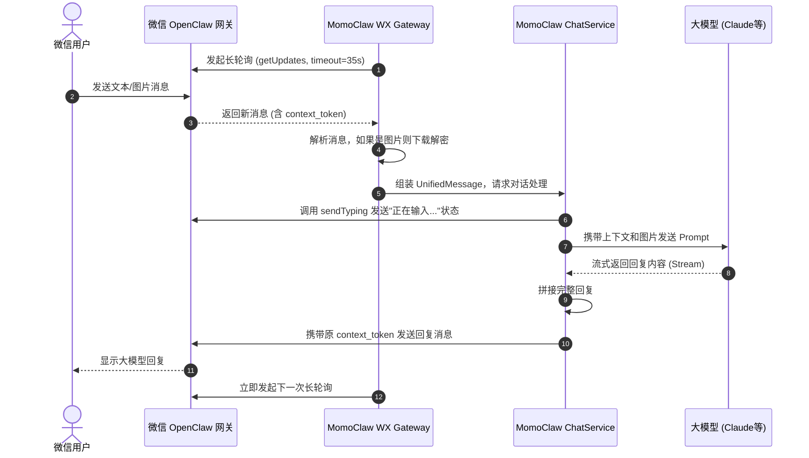

# 🔥 告别轮子！AI Agent 接入微信的优雅方案

前几天，有个非技术朋友在微信上问我：“你天天捣鼓的那个 MomoClaw 挺好用的，能不能直接拉到我的微信里？或者我加它个微信好友？微信的日常信息更多，在飞书上的话总感觉有些不太方便。”

这一下把我问住了。市面上虽然有很多飞书、钉钉的现成接入方案，但要把咱们自己写的 Agent（比如我的 MomoClaw）原生、稳定地接入微信，还是有一些门槛的。微信的接入方案并没有官方文档或者现成的接入方案，需要自己去研究和实现。

于是，我决定周末爆肝，硬核手撸一个微信网关，把 MomoClaw 正式接入微信。今天，就把这份“踩坑指南”和核心源码毫无保留地分享给你，小白也能看得懂！

## 先行原理

MomoClaw 原本已经支持了终端 CLI 交互和飞书渠道。为了覆盖更广泛的 C 端使用场景，我们需要将其接入微信。
与飞书开放平台的 Webhook 机制不同，微信 OpenClaw 插件采用的是**长轮询 (Long Polling)** 机制，且多媒体文件采用端到端 **AES-128-ECB 加密**。因此，我们需要在 MomoClaw 中新增一个完全遵循该协议的微信网关模块。

## 改造目标
1. **纯 Node.js 实现**：不依赖外部 Python 进程，直接在宿主机代码中实现微信通信协议。
2. **多用户隔离**：微信里的每个用户都能拥有自己独立的对话上下文。
3. **多模态支持**：除了文本，还要支持用户发送图片给大模型（如交给 Claude 3.5 Sonnet 进行图像理解）。

## 🎁 核心干货：微信 Bot 接口速查表

在讲原理之前，先上干货！如果你也想让你的 Agent 接入微信，下面这些核心 API 端点和必备的第三方库，建议直接截图保存：

### 🛠️ 微信核心 API 速查表

| 功能模块 | 接口路径 | 请求方法 | 核心说明 |
| :--- | :--- | :--- | :--- |
| **获取消息** | `/ilink/bot/getupdates` | POST | 核心机制！最长挂起 35s 的长轮询接口 |
| **发送消息** | `/ilink/bot/sendmessage` | POST | 支持文本、图片、视频、文件等回复 |
| **状态提示** | `/ilink/bot/sendtyping` | POST | 发送“正在输入...”状态（极大提升体验） |
| **扫码登录** | `/ilink/bot/get_bot_qrcode` | GET | 获取登录用的二维码 |

---

## 🔍 核心架构：我们是如何设计的？

要让 Agent 稳定运行，咱们不能只写个简单的脚本。在这次改造中，我给 MomoClaw 设计了一个“四层汉堡包”架构：

1. **Client 层（登录员）**：负责把二维码打印出来让你扫码，并把登录凭证（Token）保存好。
2. **Gateway 层（门卫大爷）**：负责“长轮询”，死死盯着微信服务器，一有新消息就抓过来。
3. **Crypto 层（解密专家）**：专门处理被加密的图片和语音文件。
4. **Bot 胶水层（翻译官）**：把微信复杂的协议格式，翻译成大模型能听懂的人话。



## 🔄 全链路解析：一条消息的奇幻漂流

为了让大家更清晰地理解，我们把目光聚焦到一次完整的对话上。从你扫码登录开始，到大模型把回复推送到你的微信上，这中间到底发生了什么？

### 步骤一：扫码登录与身份认证 (Client 层)

微信 Bot 的启动并不是给个静态 Token 就完事了，它模拟了微信网页版的登录体验。

1. **获取“入场券”**：我们的代码首先调用 `/ilink/bot/get_bot_qrcode`，拿到一个 `qrcode`（作为这长轮询的 ID）和 `qrcode_img_content`（二维码的实际内容）。
2. **终端打印**：借助 `qrcode-terminal` 库，直接在你的黑黑的命令行窗口里画出这个二维码。
3. **疯狂试探（状态轮询）**：接着，代码会开启一个递归轮询，每隔 2 秒就去问微信服务器（`/ilink/bot/get_qrcode_status`）：“我主人扫码了吗？确认登录了吗？”
4. **获取与持久化 Token**：当你在手机上点击“确认登录”后，服务器终于松口，返回一个珍贵的 **Bot Token**。为了避免每次重启都要扫码，MomoClaw 会把它不仅保存在内存中，还会持久化写入到本地的 `.wx_token.json` 文件里，作为后续所有请求的“通行证”。

```typescript
// Client层：扫码登录核心逻辑 (精简版)
async loginWithQrcode() {
  console.log('正在请求登录二维码...');
  // 1. 获取二维码内容
  const qrRes = await this.request('/ilink/bot/get_bot_qrcode', 'GET');
  
  // 2. 在终端打印二维码供用户扫码
  qrcode.generate(qrRes.qrcode_img_content, { small: true });
  console.log('请使用微信扫码登录：');
  
  // 3. 开始递归轮询扫码状态
  return this._getQrcodeStatusPoll(qrRes.qrcode);
}

async _getQrcodeStatusPoll(qrcodeId: string) {
  const statusRes = await this.request(`/ilink/bot/get_qrcode_status?qrcode=${qrcodeId}`, 'GET');
  
  // 4. 如果状态是 confirmed，说明用户在手机上点击了确认
  if (statusRes.ret === 0 && statusRes.status === 'confirmed') {
    console.log('登录成功！保存 Token。');
    this.saveTokenToLocalFile(statusRes); // 持久化 Token
    return statusRes;
  } else {
    // 没扫码或没确认，等 2 秒再问一次
    await new Promise((resolve) => setTimeout(resolve, 2000));
    return this._getQrcodeStatusPoll(qrcodeId);
  }
}
```

### 步骤二：蹲守新消息（Gateway 层的长轮询）

拿到了通行证，我们的“门卫大爷”（Gateway）就开始工作了。

微信的 API 是被动的，你需要不断地去调用 `/ilink/bot/getupdates` 接口。但如果每秒钟都去问，服务器肯定受不了。
所以，微信采用了**长轮询 (Long Polling)** 技术：
当你发过去一个请求，如果没有新消息，微信服务器不会立刻告诉你“没有”，而是把你的请求**挂起**。它会让你在线等，最多等 **35秒**。
- 如果这 35 秒内，有人给你发微信了，服务器立刻把消息顺着这个请求扔给你。
- 如果 35 秒过去了还是没人理你，服务器会返回一个空结果，然后你的代码马上再发起下一次长轮询，继续蹲守。

```typescript
// Gateway层：长轮询死循环 (精简版)
async pollLoop() {
  while (this.isRunning) {
    try {
      // 发起长轮询请求，服务器最多挂起 35 秒
      const res = await this.client.getUpdates(this.getUpdatesBuf);

      // 如果 Token 过期（错误码 -14），则退出循环，要求重新扫码
      if (res.ret === -14) {
        console.error('会话已过期，请重新扫码登录。');
        this.isRunning = false;
        break;
      }

      // 更新下一次请求所需的游标
      if (res.get_updates_buf) {
        this.getUpdatesBuf = res.get_updates_buf;
      }

      // 如果有新消息，挨个处理
      if (res.msgs && res.msgs.length > 0) {
        for (const msg of res.msgs) {
          await this.handleMessage(msg);
        }
      }
    } catch (e) {
      // 遇到网络波动，歇 3 秒再继续蹲守，防止死循环刷爆 CPU
      await new Promise((r) => setTimeout(r, 3000));
    }
  }
}
```

### 步骤三：拆解消息与多模态预处理 (Crypto 与 Bot 层)

好不容易蹲到了一条消息！但打开一看，里面的格式复杂得让人头皮发麻。
我们的 Bot 胶水层需要快速完成以下工作：

1. **提取核心信息**：把发送者 ID（用来区分是谁发的消息，实现**多用户隔离**）、消息 ID、文本内容提取出来。
2. **保存上下文令牌**：极其重要的一步！把 `context_token` 偷偷藏进内存里，后面回复时要用。（这部分在下面会作为“踩坑点一”详细讲）。
3. **处理图片等多媒体**：如果这是一张图片，我们不能直接拿到明文，而是拿到了一串加密参数。我们需要去 CDN 下载加密的二进制流，然后用 `AES-128-ECB` 算法把它解密出来，并存到宿主机的 `./workspace/temp/` 临时目录里。

做完这些，这乱七八糟的微信消息，终于被包装成了我们大模型能看懂的标准化结构（`UnifiedMessage`）。

```typescript
// Gateway层：消息拆解与图片预处理 (精简版)
async handleMessage(msg: WeixinMessage) {
  // 1. 只处理普通用户的消息
  if (msg.message_type !== 1) return;

  // 2. 偷偷保存这位用户的专属上下文接力棒
  if (msg.context_token) {
    this.contextTokenStore.set(msg.from_user_id, msg.context_token);
  }

  const unifiedMsg = {
    chatId: msg.from_user_id,
    text: '',
    imageUrls: [] as string[],
  };

  // 3. 遍历消息里的所有零件（可能包含多段文字或多张图片）
  for (const item of msg.item_list) {
    if (item.type === 1) {
      // 处理纯文本
      unifiedMsg.text += item.text_item.text;
    } else if (item.type === 2) {
      // 处理图片：下载加密流 -> 解密 -> 保存到本地
      const { encryptQueryParam, aesKey } = extractImageParams(item.image_item);
      const encryptedBuf = await downloadFromCDN(encryptQueryParam);
      
      // 调用 Crypto 层解密
      const decryptedBuf = decryptAesEcb(encryptedBuf, aesKey); 
      
      // 保存到本地 temp 目录，并记录路径
      const filename = `wx_img_${Date.now()}.jpg`;
      fs.writeFileSync(`./workspace/temp/${filename}`, decryptedBuf);
      
      // 记录容器内的绝对路径，供大模型读取
      unifiedMsg.imageUrls.push(`/workspace/temp/${filename}`);
    }
  }

  // 把整理好的消息发给核心对话服务
  this.emit('message', unifiedMsg);
}
```

### 步骤四：模型推理与人性化反馈 (Core 层)

现在，大模型（如 Claude）接到了任务，开始哼哧哼哧地思考。

**高能预警 1：状态提示**：大模型思考可能需要好几秒，为了不让用户以为机器人死机了，我们的 Core 层会在处理对话前，赶紧调用微信的 `/ilink/bot/sendtyping` 接口（`showTypingIndicator`）。此时，用户的微信聊天框顶端就会出现那句令人安心的：“**对方正在输入...**”。

**高能预警 2：巧用容器读取图片**：MomoClaw 处理图片的方式很巧妙。它没有直接把图片 base64 传给 API，而是在传给大模型的 Prompt 后面追加了一句 `[Images uploaded: /workspace/temp/xxx.jpg]`，利用大模型在容器内直接读取本地文件系统的能力来理解图像！

大模型的回答通常是像挤牙膏一样一段一段流式返回的（触发 `onChunk`）。但微信不支持像飞书那样修改已经发出去的消息卡片。
因此，我们在内存里把大模型流式吐出的文字不断拼接，等它彻底说完，再进入最后一步。

```typescript
// Bot胶水层：请求大模型推理 (精简版)
async handleMessage(msg: UnifiedMessage) {
  // 1. 赶紧给微信发个状态，告诉用户“对方正在输入...”
  await this.client.showTypingIndicator(msg.chatId, msg.contextToken);

  // 2. 组装 Prompt，如果是图片，巧妙地告诉大模型图片的本地路径
  let prompt = msg.text;
  if (msg.imageUrls.length > 0) {
    prompt += `\n[Images uploaded: ${msg.imageUrls.join(', ')}]`;
  }

  let fullReply = '';
  
  // 3. 调用核心服务，让大模型开始流式输出
  await processChat({
    content: prompt,
    session: this.getSession(msg.chatId),
    onChunk: (chunk) => {
      // 微信不支持改消息，所以我们先憋着，把挤出来的字拼在一起
      fullReply += chunk;
    }
  });

  // 4. 等大模型彻底说完，进入发送步骤
  await this.sendReply(msg.chatId, fullReply);
}
```

### 步骤五：原路返回（发送回复）

拿到完整的回答后，我们要调用 `/ilink/bot/sendmessage` 接口把消息发回给用户。
这里的关键是：我们要从 `contextTokenStore` 里取出最新的 `context_token`，原封不动地带上发送。这样微信才知道：“哦，这句回答是针对刚才那个会话的。”
最后，再调用一次接口隐藏掉“正在输入”的状态（`hideTypingIndicator`）。

```typescript
// Bot胶水层：发送回复 (精简版)
async sendReply(chatId: string, replyText: string) {
  if (!replyText.trim()) return;

  // 1. 极其关键！从字典里掏出这位用户最新的接力棒（Token）
  const currentToken = this.gateway.getContextToken(chatId);

  // 2. 带着接力棒，把组装好的完整长文发给用户
  await this.client.sendTextMessage(chatId, replyText, currentToken);

  // 3. 消息发出去了，取消顶部的“正在输入...”状态
  await this.client.hideTypingIndicator(chatId, currentToken);
}
```

消息发送成功，一轮奇幻漂流完美落幕！接下来，让我们来聊聊在这套流程里，最容易让人掉头发的两个大坑。

---

### 🚧 踩坑点一：拿捏“长轮询”与“上下文令牌 (Context Token)”

> "微信的 Context Token 就像是对话的『接力棒』，掉在地上，这场对话就断了。" —— *MomoClaw 开发手记*

微信并不是一有消息就主动推送给你（这叫 Webhook），而是需要你主动去问（长轮询）。你去问服务器“有新消息吗？”，如果没有，服务器会让你在线等（最多等 35 秒）。

**最容易踩坑的地方来了**：每条收到的用户消息里，都藏着一个极其重要的 `context_token`。你的 Agent 在回复这位用户时，**必须**原封不动地把这个 Token 带回去。如果你搞丢了，你的回复消息就会直接石沉大海！


### 🚧 踩坑点二：多模态支持（破解图片加密）

现在的大模型（比如 Claude 3.5 Sonnet）都有了“眼睛”，咱们的 Agent 怎么能不支持看图呢？

但微信为了安全，把图片存在了 CDN（内容分发网络）上，并且加了一层 **AES-128-ECB** 密码锁。

我们需要利用 Node.js 原生的 `crypto` 模块把这层密码锁撬开。下面这段代码就是专门用来做 AES-128-ECB 解密的：

```typescript
import crypto from 'crypto';

/**
 * 【函数功能】：AES-128-ECB 解密函数
 * 【新手提示】：就像是用一把钥匙去开一把锁，我们把加密的数据和钥匙传进去，就能拿到原始的数据。
 *
 * 参数说明:
 * - ciphertext: 被加密的原始数据（二进制流）
 * - key: 解密用的钥匙（Buffer 格式）
 */
export function decryptAesEcb(ciphertext: Buffer, key: Buffer): Buffer {
    // 1. 创建一个解密器，指定算法为 aes-128-ecb，并传入钥匙
    // 注意：ECB 模式不需要初始化向量（IV），所以第三个参数传 null
    const decipher = crypto.createDecipheriv('aes-128-ecb', key, null);
    
    // 2. 自动处理数据填充。微信使用的是 PKCS7 填充，Node.js 默认支持
    decipher.setAutoPadding(true); 
    
    // 3. 开始解密：把密文喂给解密器，然后把解密后的结果拼接起来
    return Buffer.concat([decipher.update(ciphertext), decipher.final()]);
}
```

## 💡 提升用户体验的“小心机”

AI 大模型思考是需要时间的（有时候可能要想好几秒）。如果不做处理，用户发完消息后，微信界面毫无反应，大家大概率会觉得你的机器人“死机”了或者断网了。

**强烈建议**：在你的代码把问题发给大模型之前，先调用一次 `/ilink/bot/sendtyping` 接口。这样用户的微信聊天框顶端就会显示“**对方正在输入...**”。
等大模型把几百字的长篇大论写完后，咱们再把结果一次性发过去。这个小细节，能让你的 Agent 瞬间拥有“人情味”，体验提升 100%！

## 🤝 总结与理性思考

经过这个周末的折腾，咱们的自定义 Agent 终于完美接入了微信，不仅实现了终端直接扫码登录，还能让每个人都有独立的对话记忆（多用户隔离），甚至能看懂我们发过去的图片。从 0 到 1 撸一个微信网关确实有点掉头发，但当看到 Agent 在微信里如人类般自然对答的那一刻，一切都值了。

不过，在完整走通了这条路之后，我也产生了一些**理性的思考**：

目前微信提供的这套底层协议（OpenClaw 插件机制），坦白讲，**始终还是一个 MVP（最小可行性产品）版本**。
它非常适合个人用户与 Agent 之间进行 1V1 的简单对话和日常碎片化信息处理。但如果想要用它来实现像飞书那样丰富的消息卡片、群组机器人的多样化协作、甚至是复杂的业务流打通，两者之间还是有很大差距的。

从这一点上，我们或许能管中窥豹：**微信的定位依然坚守着私人社交的克制，短期内大概率不会向重度协作的“办公场景”开放过于底层的能力。** 办公协同的活儿，还是交给企业微信和飞书吧！

### 🌟 为什么不直接试试 MomoClaw 呢？

仓库地址：https://github.com/1360151219/momoclaw

如果你觉得上面这些踩坑点太折磨人，不想自己从头造轮子，那么强烈推荐你直接使用 **MomoClaw**！
MomoClaw 是一个开箱即用的 AI Agent 框架，它不仅已经帮你把上述的**微信接入（含扫码登录、多用户隔离、图片解密等）**全部封装好了，还支持 **终端 CLI 交互** 和 **飞书渠道**。
最棒的是，它的架构设计极其优雅，利用容器化技术让大模型具备了直接读取本地文件的能力。无论你是想做一个私人的微信 AI 助手，还是想在公司内部署一个飞书答疑机器人，MomoClaw 都能帮你一键搞定。

> MomoClaw 还在持续开发中，有什么问题或建议，欢迎在评论区留言！

欢迎在评论区和我吐槽！或者如果你想要完整的 Node.js/TypeScript 源码，也可以直接去 [MomoClaw 仓库](https://github.com/1360151219/momoclaw) 一探究竟。

