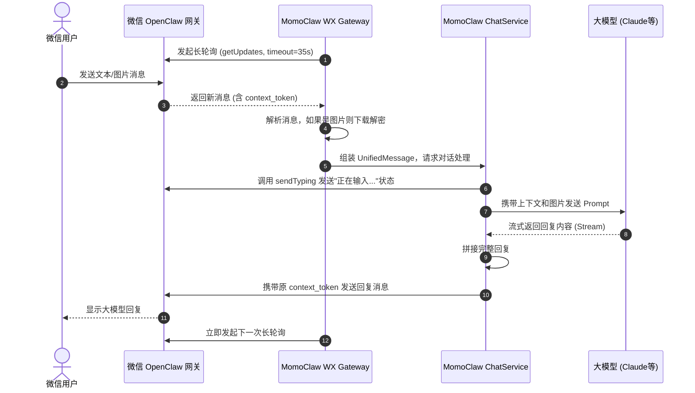

# 从零到一：MomoClaw 微信机器人接入改造与技术详解

在 AI Agent 蓬勃发展的今天，将我们的 Agent 接入用户最熟悉的聊天工具（如微信）能极大提升用户体验。本文将详细记录并解析如何将基于 Node.js 的 **MomoClaw AI Assistant** 接入微信平台（基于腾讯 OpenClaw 微信渠道插件协议），实现双向的文本与图片通信。

---

## 1. 为什么要做这次改造？

MomoClaw 原本已经支持了终端 CLI 交互和飞书渠道。为了覆盖更广泛的 C 端使用场景，我们需要将其接入微信。
与飞书开放平台的 Webhook 机制不同，微信 OpenClaw 插件采用的是**长轮询 (Long Polling)** 机制，且多媒体文件采用端到端 **AES-128-ECB 加密**。因此，我们需要在 MomoClaw 中新增一个完全遵循该协议的微信网关模块。

### 改造目标
1. **纯 Node.js 实现**：不依赖外部 Python 进程，直接在宿主机代码中实现微信通信协议。
2. **多用户隔离**：微信里的每个用户都能拥有自己独立的对话上下文。
3. **多模态支持**：除了文本，还要支持用户发送图片给大模型（如交给 Claude 3.5 Sonnet 进行图像理解）。

---

## 2. 核心架构与业务流程

我们为 MomoClaw 的 `host/src` 新增了 `weixin` 目录，采用了分层架构设计：

- `client.ts`: 负责 API 鉴权、扫码登录以及请求头构建。
- `gateway.ts`: 负责与服务器建立长轮询连接，拉取消息。
- `crypto.ts`: 负责处理 CDN 图片的解密。
- `bot.ts`: 业务胶水层，将微信消息转化为 MomoClaw 的标准输入。

### 2.1 整体时序图

下面是微信用户发送一条消息到大模型回复的完整交互流程：



---

## 3. 核心技术难点与破局

在接入过程中，我们遇到了几个典型的技术难点。

### 3.1 扫码登录与状态机

微信 Bot 并不是通过静态的 Token 启动的，而是需要通过**扫码授权**。
我们在 `client.ts` 中引入了 `qrcode-terminal`，将获取到的登录二维码直接渲染在终端：

1. 调用 `get_bot_qrcode` 获取二维码 URL 和 `uuid`。
2. 终端打印二维码。
3. 定时器每 2 秒轮询 `get_qrcode_status`。
4. 扫码成功后提取 `Bot Token` 存入内存，供后续请求的 `Authorization` 头使用。

### 3.2 破解"长轮询"与"上下文令牌"机制

**长轮询 (Long Polling)** 是一种非常经典的伪实时通信方案。我们的客户端发送请求到 `/ilink/bot/getupdates`，如果没有新消息，微信服务器会把这个请求“挂起”最长 35 秒。

同时，微信协议中有一个极其严格的要求：**`context_token`**。
每条收到的消息都带有一个会话上下文令牌，Bot 在回复该用户时，**必须**原样将这个令牌带回去，否则消息会丢失。
为此，我们在 `Gateway` 中设计了一个内存字典，时刻守护每个用户的最新 Token：

```typescript
// gateway.ts 节选
private contextTokenStore: Map<string, string> = new Map(); // userId -> context_token

private async handleMessage(msg: WeixinMessage) {
  if (msg.context_token) {
    this.contextTokenStore.set(msg.from_user_id, msg.context_token);
  }
  // ... 传递给业务层
}
```

### 3.3 CDN 媒体加解密 (图片理解的支持)

大模型现在都具备视觉能力了，怎么能不支持图片呢？
但微信的图片并不在 API 里直接传递，而是放在 CDN 上，并且使用了 **AES-128-ECB 加密**。

当用户发送图片时，消息体长这样：
```json
{
  "type": 2,
  "image_item": {
    "aeskey": "1a2b3c4d...",
    "media": { "encrypt_query_param": "..." }
  }
}
```

我们利用 Node.js 原生的 `crypto` 模块实现了解密逻辑：

```mermaid
graph LR
    A[提取 encrypt_query_param 和 aeskey] --> B[拼接 CDN URL]
    B --> C[下载加密二进制流]
    C --> D[AES-128-ECB 解密 (去除PKCS7填充)]
    D --> E[保存至 workspace/temp 目录]
    E --> F[将文件路径传给多模态大模型]
```

核心解密代码非常简洁：
```typescript
// crypto.ts 节选
import crypto from 'crypto';

export function decryptAesEcb(ciphertext: Buffer, key: Buffer): Buffer {
  const decipher = crypto.createDecipheriv('aes-128-ecb', key, null);
  decipher.setAutoPadding(true); // Node.js 默认支持 PKCS7
  return Buffer.concat([decipher.update(ciphertext), decipher.final()]);
}
```

### 3.4 体验优化：打字机与状态提示

微信不支持像飞书那样修改已发出的消息卡片，所以无法实现“打字机”般一个字一个字往外蹦的效果。
如果等大模型生成完几百个字再回复，用户会觉得机器人“死机”了。

我们的解决策略是：
1. **即时反馈**：在模型开始推理前，调用 `/ilink/bot/sendtyping`，让用户的微信顶端显示“对方正在输入...”。
2. **完整下发**：在后端接收大模型的流式（Stream）输出并进行拼接，等生成完毕后一次性发送给微信。

---

## 4. 总结与展望

通过本次改造，MomoClaw 成功解锁了微信生态，具备了以下能力：
- 🟢 终端直接扫码，无缝登录。
- 🟢 一用户一会话，互不干扰 (`wx_用户ID` 映射)。
- 🟢 支持接收图片，充分利用大模型的多模态能力。
- 🟢 优雅处理长轮询与异常断线重连。

**未来可优化方向：**
1. **语音支持**：引入 SILK 解码和语音识别（ASR），让用户可以直接给机器人发语音。
2. **长文本分段**：由于微信单条消息有字数限制，后续可在 `bot.ts` 中加入分段发送逻辑，确保长篇大论不会被截断。

希望这篇报告能为正在做 AI Agent 微信接入的开发者提供一些参考与启发！
